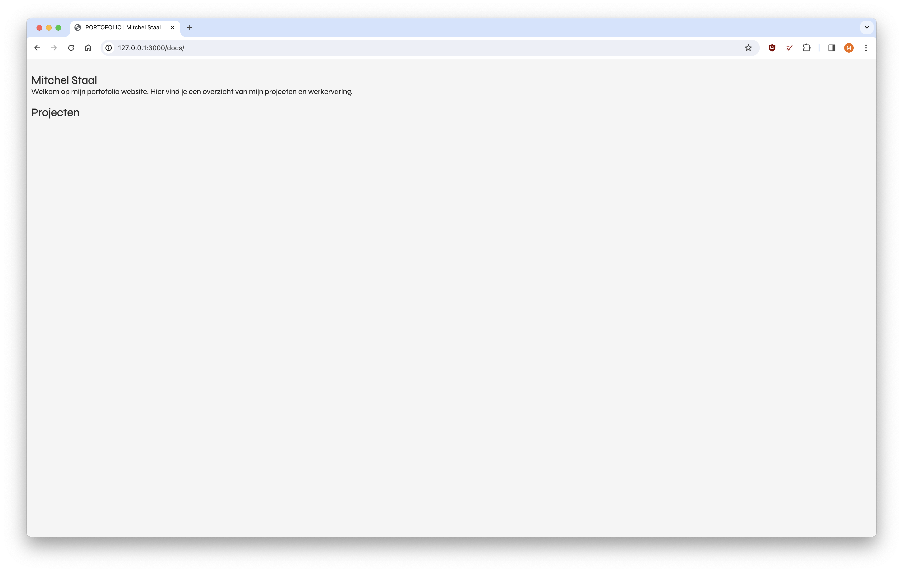
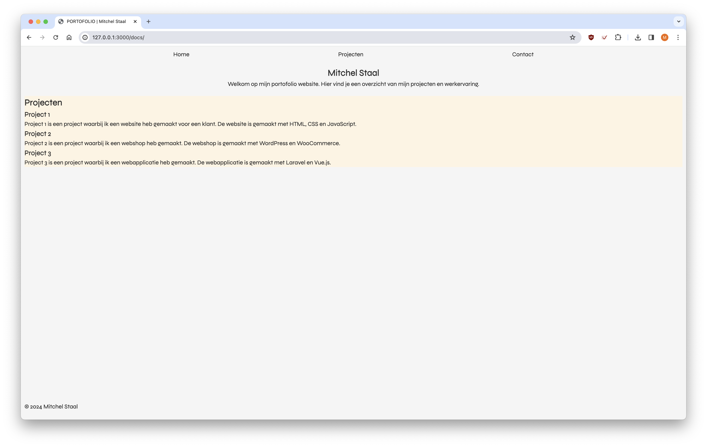
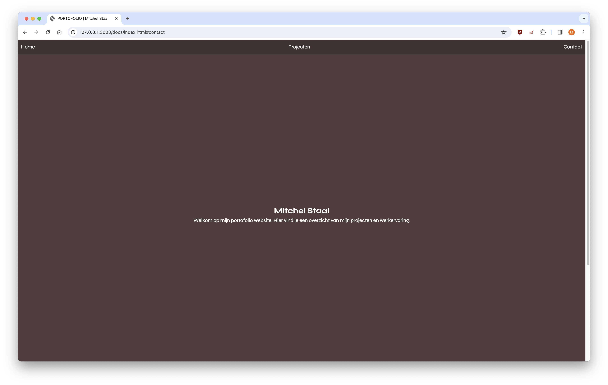
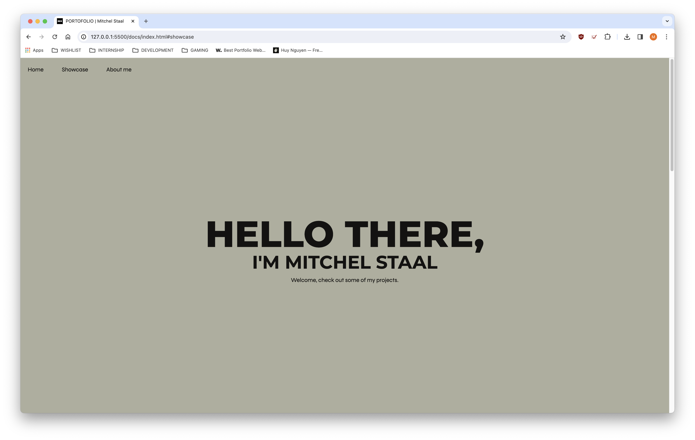
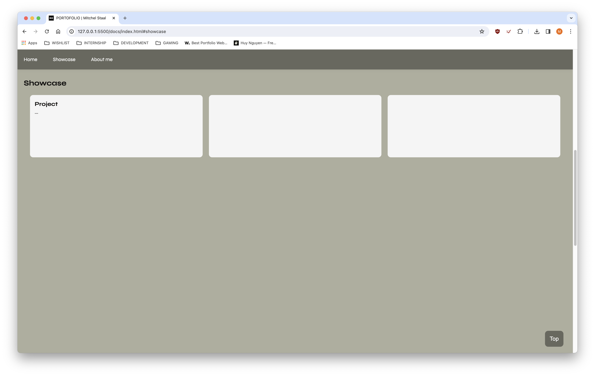
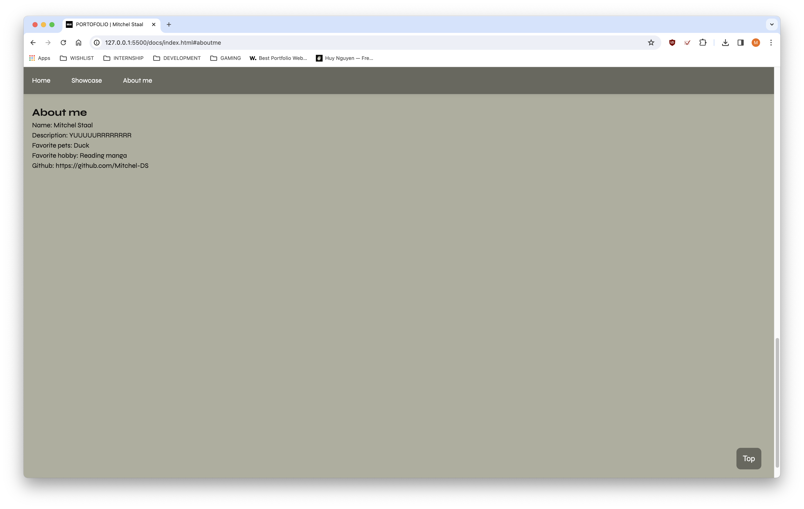
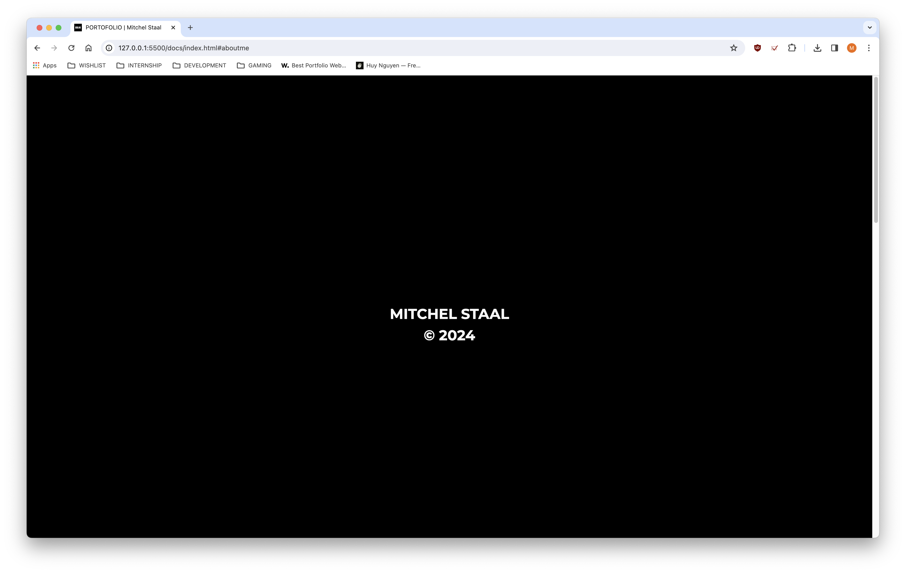
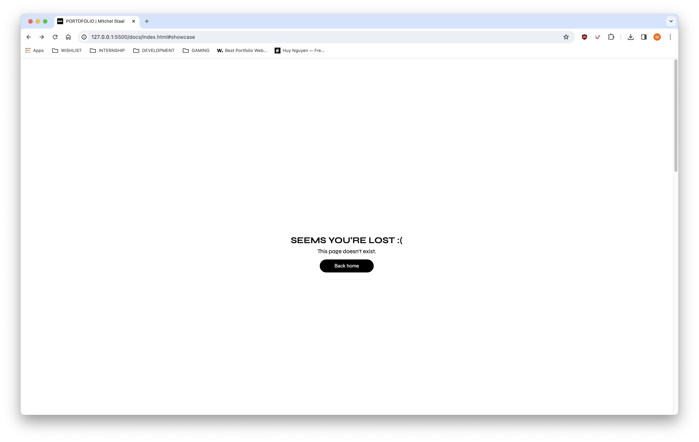

# Web App From Scratch @cmda-minor-web 2023 - 2024


## Introduction

In this course you will learn to build a web application without frameworks or unnecessary libraries, but with vanilla HTML, CSS & JavaScript as much as possible. The end result is a modular, single page web app (SPA). Data will be retrieved from an external API, manipulated and finally shown in the UI of the App. You will learn to apply interface principles when building and testing the interface. With the gained knowsledge you will be able to build interactive prototypes, based on a user story and real data. Also you will gain a better understanding of how API's, frameworks and libraries work.

## Live demo

Check out the live demo [here.](https://mitchel-ds.github.io/web-app-from-scratch-2324/)

## Teamwork

In the first week we were mostly working on our personal applications. During the first few days we thought of what the general idea of our team application would be and what needed to be included in our own application.

Besides that, the teamwork went fine. Nothing too special. Everyone did their best and delivered their work on time, so nothing to complain about.

## Log

### Version 1





### Version 2





splash screen

error page


## Issues

### Back to top micro interaction

I tried to give the top button some micro interaction, by giving it an animation during the duration of the page scroll back up. It didn't really go to well. 

```js
function backTop() {
    document.documentElement.scrollTop = 0; // brings the user to the top of the page

    if (document.documentElement.scrollTop === 0) {
        topButton.classList.remove('topClicked');
    } else {
        topButton.classList.add('topClicked');
    }
}
```
Here is the function that brings the user back up, and I wanted to give the button a class, so I could play the animation, but it doesn't remove the class right after, because it only checks when clicked on (it's a eventlistener that checks the scroll.)

### Infinite scroll carousel

Here I tried making an infinite scroll carousel, where you could still scroll back and see, but I just couldn't figure out the proper calculation to make it fit the width and where it would reset.

```css
container {
    animation: scroll 5s linear infinite;
	width: calc(250px * 14);
}
```

```js
@keyframes scroll {
	0% { transform: translateX(0); }
	100% { transform: translateX(calc(-250px * 17))}
}
```

sources: 
- https://codepen.io/studiojvla/pen/qVbQqW


### Skeleton loader for loading state

I didn't know how to implement a loading state into my application, because I have never worked with states before, so it was difficult finding out how it works. But it was easier to figure out then I thought.

So here during the fetching of the api data with the try and catch I just made it, so if the data is not picked up in any way it will hide the container and show the placeholder and also the other way around (pretty easy :D).

```js
async function fetchProjects() {
    try {
        const res = await fetch("https://api.github.com/users/Mitchel-DS/repos");
        const data = await res.json();
        console.log(data);

        showcaseLoader.style.display = "none";
        showcase.style.display = "flex";

        const projects = document.querySelector('.showcase ul');
        data.forEach(project => {
            const projectContainer = document.createElement('li');
            projectContainer.classList.add('project');

            const projectName = document.createElement('h3');
            projectName.innerHTML = project.name;
            projectContainer.appendChild(projectName);

            const projectDesc = document.createElement('p');
            projectDesc.innerHTML = project.description;
            projectContainer.appendChild(projectDesc);

            const projectLink = document.createElement('a');
            projectLink.innerHTML = "View project";
            projectLink.href = project.html_url;
            projectLink.target = "_blank"; // opens the link in a new tab
            projectContainer.appendChild(projectLink);

            projects.appendChild(projectContainer);
        });
    } catch (error) {
        console.log(error);
        showcaseLoader.style.display = "flex";
        showcase.style.display = "none";
    }
}
```

sources: 
- https://www.freecodecamp.org/news/how-to-build-skeleton-screens-using-css-for-better-user-experience/

## Feedback 09-02

> *"It could be elaborated more extensively in terms of design. The way of showcasing the projects could be more unique (instead of flex carousel). Show more techniques."*

> *"Kan wat uitgebreider worden uitgewerkt qua vormgeving. De manier van het showcasen van de projecten kan wat unieker (ipv flex carousel). Laat meer technieken zien."*

## Accessibility

## Checklist

[] Clean vanilla HTML, CSS and JS.
[] Diverse content?
[] Detailed micro-interaction (with JS).
[] Data connection (API call).
[] Data for team app (json file).
[] Application is accessible.
[] Professional design.
[] Responsive
[] Documented

## To do (as much as possible)
[] Style the coursel 
[] Fix the infinite scroll carousel?
[x] Add skeleton loader for the loading state.
[] Add error state
[] Add animations
